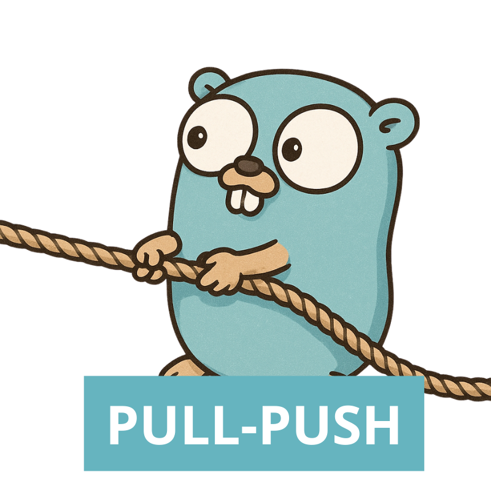

<div align="center">



# Pull-Push


Pull-Push is a small application helping you to move files across different Storages.<br/>
Under the hood it utilize parallel multipart upload/download to move things fast.

</div>

## Features

- [x] Http => S3
- [ ] Http => GPC Storage
- [ ] Http => Azure Storage (in progress)
- [ ] Azure Storage => GCP Storage
- [ ] Azure Storage => S3
- [ ] S3 => Azure Storage
- [ ] S3 => GCP Storage
- [x] GCP Storage => S3
- [ ] GCP Storage => Azure Storage

## Installation

```sh
go install
```

## Usage

Http -> \*

```sh
pull-push --pull <file-url> --to <bucket-name> --push <file-path>
```

Azure/GCP/S3 -> \*

```sh
pull-push --from <bucket-name> --pull <file-path> --to <bucket-name> --push <file-path>
```

## Local Development

```sh
go mod download
```

With localstack:

```sh
docker-compose up
```
