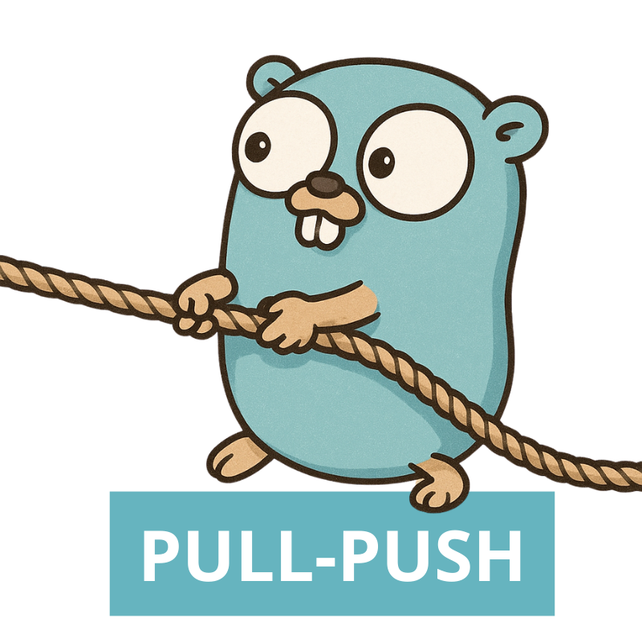

<div align="center">



# PullPush


Pull Push is a small application helping you to move files across different Storages.
Under the hood it utilize parallel multipart upload/download to move things fast.

</div>

## Features

- [x] Http => S3
- [ ] Http => GPC Storage
- [ ] Http => Azure Storage
- [ ] Azure Storage <=> GPC Storage
- [ ] S3 <=> Azure Storage
- [ ] S3 <=> GPC Storage

## Installation

```sh
go mod download
```

## Local Development

With localstack:

```sh
docker-compose up
```
